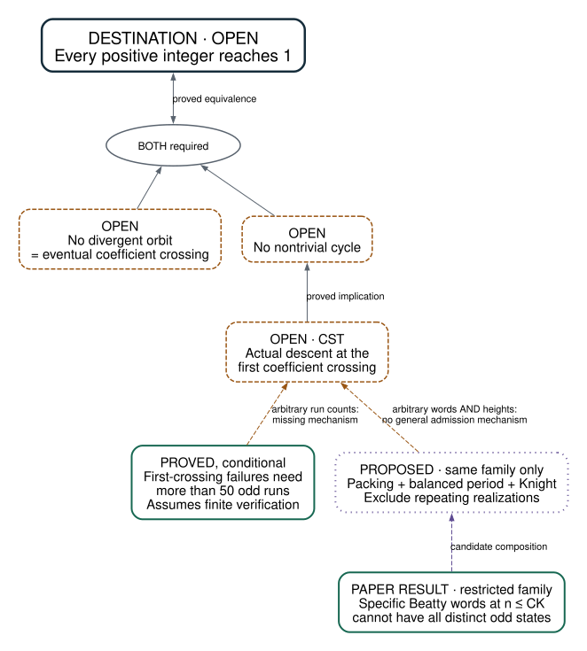

# Collatz: where the proof stands

**Project map · 26 September 2026**  
[Visual edition](OVERVIEW.html) · [Detailed research review](REVIEW-2026-09-25-trajectory.md)

## The destination

**Every positive integer eventually reaches 1.**  That requires ruling out both an orbit that never repeats and never reaches 1, and a cycle other than the familiar one.  Neither has been ruled out.

The recent work has made these two obstacles much more precise.  It has also excluded restricted kinds of counterexample.  **There is still no mechanism covering all possible counterexamples.**

## The map

**Reading the map:** solid arrows are established implications, even when their starting assumptions remain open.  Dashed arrows are missing research steps.  The two global fronts are needed **together**.  “Paper” means a written argument that has not yet been transferred to Lean.

## What we have actually established

| Result | What it tells us | Its boundary |
|---|---|---|
| **An exact split of Collatz into two fronts** | No divergence **and** no nontrivial cycle would prove Collatz. | Neither front is closed. |
| **Coefficient crossing is equivalent to no divergence** | The linear multiplier along an orbit eventually falling below 1 is exactly as strong as excluding divergence. | This reformulation has not made the open claim easier. |
| **Descent at first crossing would exclude cycles** | If the actual integer is always smaller when its multiplier first falls below 1, nontrivial cycles cannot exist.  This is the open statement called **CST**. | Additive terms can defeat multiplier contraction; ruling that out is the work. |
| **First-crossing failures need more than 50 odd runs** | The Lean argument eliminates the few-run cases, assuming the explicitly stated finite verification bound. | The paper reaches 68; increasing this cutoff does not address arbitrary run counts. |
| **Finite temporal packing for one balanced family** | At starting height at most a fixed constant times word length, sufficiently long Beatty words cannot be realized by distinct odd states. | This is a paper result for one family; a realization that repeats is not yet excluded. |

An **odd run** is a consecutive block of odd steps.  A **Beatty word** spaces odd steps as evenly as an irrational slope allows.  These unusually balanced words provide a demanding test case, not an exhaustive list of dangerous words.

## Where we are pressing

### The latest concrete candidate: finish the balanced-family test

The September 25 proposal combines the finite packing result with a theorem excluding certain balanced cycles:

1. Packing forces a sufficiently long, low-height realization to repeat early.
2. Enough of the genuine Beatty prefix survives to constrain the repeating period.
3. Prove that its primitive period is circularly balanced.
4. Apply Knight's high-cycle exclusion, and separately exclude the trivial cycle.

**This composition is unproved.**  The candidate note records the delicate points, including the artificially appended final symbol, which cannot be treated as part of the balanced prefix.  No proof step has followed that note in the inspected branch.

**A successful result would say:** for every fixed height multiplier, this entire balanced family eventually has no positive integer realization at that height, whether or not states repeat.  That is a definite theorem with a finish line.  It would still leave arbitrary first-crossing words and larger starting heights untouched.

### The larger missing step: exclude every first-crossing survivor

A survivor is a start whose multiplier has contracted but whose actual value has not descended.  Its arithmetic is now sharply constrained by an exact near-cycle equation.  The existing estimates eliminate relatively few odd runs; they do not eliminate the many-run region.  Even a linear lower bound on the required run count would leave that complementary region open.

**Closing CST requires a uniform obstruction to integer realization across all those words.**  There is no such obstruction on the board.  No-divergence remains a second, separate requirement.

## What would count as a change in position?

| Next result | What changes |
|---|---|
| Prove or refute the packing–balanced-period composition | Settles this composition, or eliminates the proposed mechanism. |
| Find a mechanism covering arbitrary first-crossing words | Supplies the missing route from restricted examples toward CST. |
| Prove CST | Closes the nontrivial-cycle front. |
| Prove no-divergence as well | Reaches full Collatz. |

The standing gate in [DIRECTION.md](DIRECTION.md) is appropriate: further proof campaigns need a mechanism for the actual gap.  More run bookkeeping, marginal statistics, or a higher finite cutoff do not supply one.  Retired approaches are recorded in [APPROACHES.md](APPROACHES.md).

## Evidence and upkeep

Snapshot: `main` at `751a76e`.  Read the [exact split](CollatzMoonshot/Conjecture.lean), [crossing equivalence](CollatzMoonshot/FrontA/CrossingEquivalence.lean), [CST-to-cycle implication](CollatzMoonshot/FrontA/FirstCrossingCycles.lean), [finite packing argument](RESEARCH-2026-09-22-finite-packing-christoffel.md), and [candidate composition](RESEARCH-2026-09-25-packing-balanced-period-candidate.md).

This is the maintained reader's map.  Update it when a frontier is proved, refuted, or replaced; retain the detailed chronology in the existing research notes.  Diagram source: [docs/overview.dot](docs/overview.dot).  Rebuild the visual edition with `make -f docs/overview.mk`.
